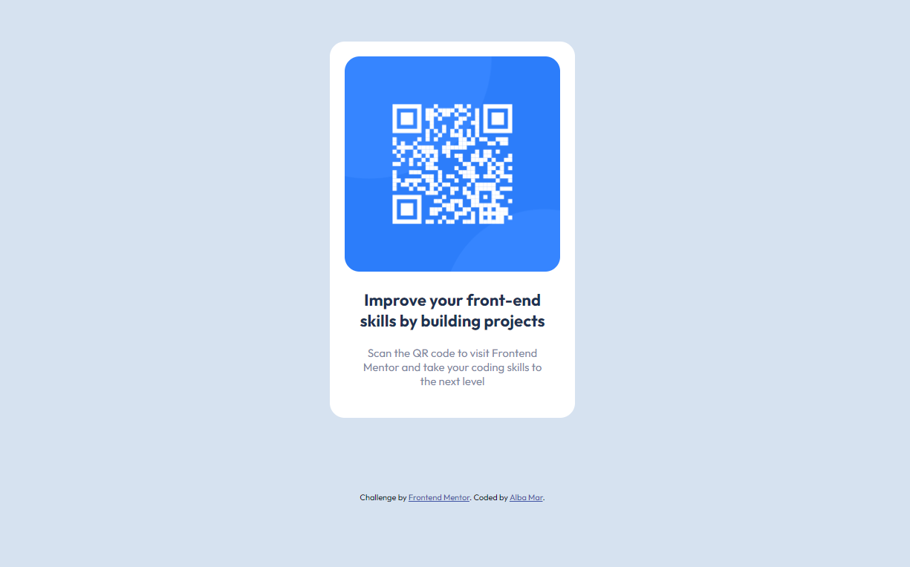

# Frontend Mentor - QR code component solution

This is a solution to the [QR code component challenge on Frontend Mentor](https://www.frontendmentor.io/challenges/qr-code-component-iux_sIO_H). Frontend Mentor challenges help you improve your coding skills by building realistic projects. 

## Table of contents

- [Overview](#overview)
  - [Screenshot](#screenshot)
  - [Links](#links)
- [My process](#my-process)
  - [Built with](#built-with)
  - [What I learned](#what-i-learned)
  - [Continued development](#continued-development)
- [Author](#author)

## Overview

### Screenshot

### Links

- Solution URL: [Add solution URL here](https://your-solution-url.com)
- Live Site URL: [Add live site URL here](https://your-live-site-url.com)

## My process

First tiny project! This was simple but still insightful, as my first challenge. 

The main thing I had to think about with this card was what method to use to center things. For the card component itself, I created a container and went with the margin auto on the left and rigth sides.

For the image and text elements I started by using flexbox. This gave me the result I wanted, but on a second pass I thought it was a bit of an overkill and ended up refactoring using percentages, since this is a small fixed width component and it won't create problems with smaller devices. 

I'm realizing I tend to overthink problems... I guess more practice will help me with that. But also, I guess that's what refactoring is for, so maybe it's not that big of a deal.

### Built with

- Semantic HTML5 markup
- CSS custom properties

### What I learned

Just because you can use flexbox doesn't mean that you should, probably.

### Continued development

Next stop, another pure HTML and CSS component that helps me get some practice with flexbox and css grid, since I'm still not really confident with layouts.

## Author

- Frontend Mentor - [@amarinite](https://www.frontendmentor.io/profile/amarinite)
- Twitter - [@alba_mar_](https://www.twitter.com/alba_mar_)

**Note: Delete this note and add/remove/edit lines above based on what links you'd like to share.**